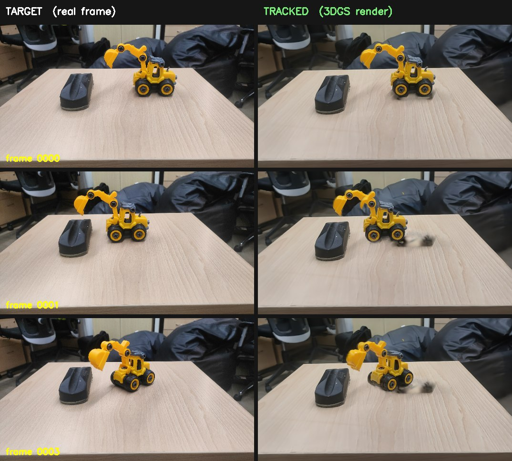
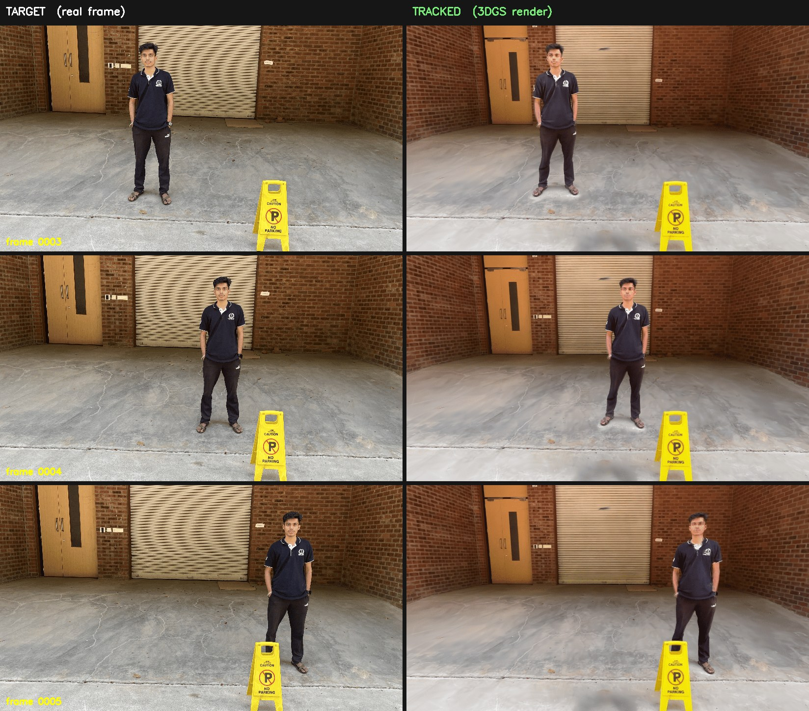

# 3DGS Dynamic Object Tracking

**Segment, edit, and track a moving object inside a 3D Gaussian Splatting scene.**

This pipeline takes a pre-trained [3D Gaussian Splatting](https://github.com/graphdeco-inria/gaussian-splatting)
reconstruction of a *static* scene, isolates a target object **in 3D**, makes the
scene editable, and then **recovers that object's 6-DoF motion** from a video —
re-posing only the object's Gaussians, frame by frame, so the rendered scene
matches reality.

---

## Results

The object below is segmented once in 3D, then tracked across a video. Each pair
shows the **real camera frame** (left) and the **3DGS scene re-rendered** (right)
after the object's pose has been estimated and applied to its Gaussians.

### Rigid object tracking



### Full-body sequence



> Tracking is **cumulative**: each frame's estimated motion is applied on top of
> the previous one, so the object is followed through the whole sequence.

---

## How it works

The system assumes a **static camera** and a **moving object**. Given a 3DGS
checkpoint + its COLMAP reconstruction, the pipeline runs five stages
([`main.sh`](main.sh) drives them interactively):

| # | Stage | Script | What it does |
|---|-------|--------|--------------|
| 1 | **3D segmentation** | [`demof.py`](demof.py) | Detects the object with YOLO-World, propagates a 2D mask with SAM 2, and lifts it to a 3D Gaussian mask via gradient voting → `mask3d.pth` |
| 2 | **Shape & bounding box** | [`object_shape_bbox.py`](object_shape_bbox.py) | Voxelizes the object, fills holes, and recovers a tight oriented bounding box / shape region |
| 3 | **Background inpainting** | [`table_inpaint_under_object.py`](table_inpaint_under_object.py) | KNN-inpaints the support surface (and shadow) under the object so it can be removed cleanly |
| 4 | **Camera alignment** | [`camera_pose_optimization.py`](camera_pose_optimization.py) | Optimizes the virtual camera pose to match the real static camera |
| 5 | **Dynamic pose tracking** | [`dynamic_object_pose_pnp.py`](dynamic_object_pose_pnp.py) | Matches keypoints (EfficientLoFTR) between render and each frame, back-projects with rendered depth, and solves **PnP + RANSAC** for the object's SE(3) motion |

```
3DGS checkpoint ─┐
                 ├─▶ [1] segment ─▶ [2] shape ─▶ [3] inpaint ─▶ editable scene
COLMAP sparse ───┘                                                   │
                                                                     ▼
real video frames ──────────────▶ [4] camera align ─▶ [5] PnP track ─▶ per-frame SE(3) pose
```

> **Camera pose — two routes.** Stage 4 above uses photometric optimization
> ([`camera_pose_optimization.py`](camera_pose_optimization.py)).
> [`viewmat_estimation.py`](viewmat_estimation.py) is an **alternative camera-pose
> estimator**: it localizes by **feature-descriptor retrieval + PnP** —
> FAISS-indexed COLMAP views (DINO global descriptors), keypoint matching, then
> robust PnP — which handles large viewpoint baselines where photometric
> optimization would need a close initialization.

A deeper, step-by-step technical description is in [`docs/PIPELINE.md`](docs/PIPELINE.md).

---

## Performance

The dynamic update loop — render → match → solve → transform → re-render — runs
end-to-end in **≈ 40 ms per frame (25 FPS)** on a single **NVIDIA RTX A6000**,
with **no per-frame optimization and no re-training**.

### Per-frame timing breakdown

| Stage | Time (ms) |
|-------|----------:|
| Reference RGB + depth render | 9.2 |
| Object-alpha render *(overlapped on a separate CUDA stream)* | *(6.8, hidden)* |
| Target image load + GPU transfer | 3.1 |
| EfficientLoFTR matching (bfloat16) | 14.7 |
| Mask filter + GPU back-projection | 0.9 |
| MAGSAC++ PnP | 2.4 |
| Gaussian transform (`index_copy_`) | 0.4 |
| Updated-scene render | 8.8 |
| **Total** | **≈ 40   (25 FPS)** |

<sub>Measured on an NVIDIA RTX A6000, averaged over 50 frames. The object-alpha
render overlaps the RGB+depth render via CUDA streams, so its cost is hidden in
the total.</sub>

### Comparison with related approaches

| Method | Per-frame object update | Per-scene training | Speed |
|--------|:----------------------:|:-----------------:|------:|
| D-NeRF *(deformation MLP)* | ✗ | required | offline |
| Deformable / 4D 3D Gaussians | ✗ | required | offline |
| Iterative photometric alignment *(Adam)* | ✓ | none | ≈ 340 ms / frame |
| **This method** *(feature matching + PnP)* | **✓** | **none** | **≈ 40 ms / frame (25 FPS)** |

<sub>D-NeRF and Deformable 3D Gaussians fit a dense deformation field to a
pre-recorded sequence and require per-scene training, so they have no directly
comparable per-frame object-pose cost. The iterative-photometric row is this
repository's own optimization-based pose route
([`camera_pose_optimization.py`](camera_pose_optimization.py)) measured on the
same hardware — accurate, but ≈ 8× slower than the feature-matching + PnP path
used for dynamic tracking.</sub>

---

## Quick start

> **Requirements:** Linux, an NVIDIA GPU with CUDA, and Conda. See
> [`installation_usage.md`](installation_usage.md) for full details.

```bash
# 1. Clone (with the EfficientLoFTR submodule)
git clone --recurse-submodules https://github.com/Himanshu-sen/3dgs-dynamic-tracking.git
cd 3dgs-dynamic-tracking

# 2. Install everything — Python env, all libraries, and model weights
bash installation.sh

# 3. Run the pipeline
conda activate 3dgs
bash main.sh
```

`installation.sh` is a **one-shot installer**: it creates a Conda environment,
installs every dependency (PyTorch, gsplat, SAM 2, EfficientLoFTR, YOLO-World,
…) and downloads all model weights. You only need to supply your **scene data**
under `data/<dataset>/` — see below.

---

## Dataset

The scene data (COLMAP reconstruction, training images, the 3DGS checkpoint, the
camera image and the video frames) is **not** bundled in this repository.

📦 **Download the sample datasets:** [**Google Drive**](https://drive.google.com/file/d/1eN68qAjqv5BhF6cfiISJVnUkrYIBHeq-/view?usp=sharing)

Expected layout per scene:

```
data/<dataset>/
├── sparse/0/            COLMAP reconstruction (cameras, images, points3D)
├── images/              training images used for the 3DGS reconstruction
├── chkpnt30000.pth      3DGS checkpoint  (INRIA format)  ── or ──
│   ckpt_*_rank0.pt      3DGS checkpoint  (gsplat format)
├── camera.jpg           image of the static camera view  (Step 4 target)
└── frames/              ordered video frames to track    (Step 5 targets)
```

Dataset preparation is described in [`installation_usage.md`](installation_usage.md#dataset-preparation).

---

## Repository structure

```
3dgs-dynamic-tracking/
├── main.sh                       End-to-end interactive pipeline (5 steps)
├── installation.sh               One-shot environment + weights installer
├── README.md                     This file
├── installation_usage.md         Full install & usage guide
├── docs/PIPELINE.md              Technical description of each stage
│
├── demof.py                      Step 1 — gradient-based 3D segmentation
├── object_shape_bbox.py          Step 2 — object shape & bounding box
├── table_inpaint_under_object.py Step 3 — background / table inpainting
├── camera_pose_optimization.py   Step 4 — camera pose via photometric optimization
├── viewmat_estimation.py         Step 4 (alt) — camera pose via descriptor retrieval + PnP
├── dynamic_object_pose_pnp.py    Step 5 — dynamic object pose (PnP)
│
├── draw_bbox.py  mask_utils.py  matching.py  utils.py
├── global_descriptors.py         DINO global descriptors (used by viewmat_estimation.py)
├── utils_for_target_update.py    Shared helpers
├── assets/                       Images used by this README
└── EfficientLoFTR/               Feature matcher (git submodule)
```

---

## Built on

This project stands on excellent open-source work:

- [3D Gaussian Splatting](https://github.com/graphdeco-inria/gaussian-splatting) & [gsplat](https://github.com/nerfstudio-project/gsplat) — scene representation & rasterization
- [Segment Anything 2](https://github.com/facebookresearch/sam2) — 2D mask propagation
- [YOLO-World](https://github.com/ultralytics/ultralytics) — open-vocabulary object detection
- [EfficientLoFTR](https://github.com/zju3dv/EfficientLoFTR) — semi-dense feature matching
- [COLMAP](https://colmap.github.io/) — camera calibration & sparse reconstruction

---

## License

No license is declared yet. Note that the dependencies above carry their own
licenses; add a `LICENSE` file before redistributing.
